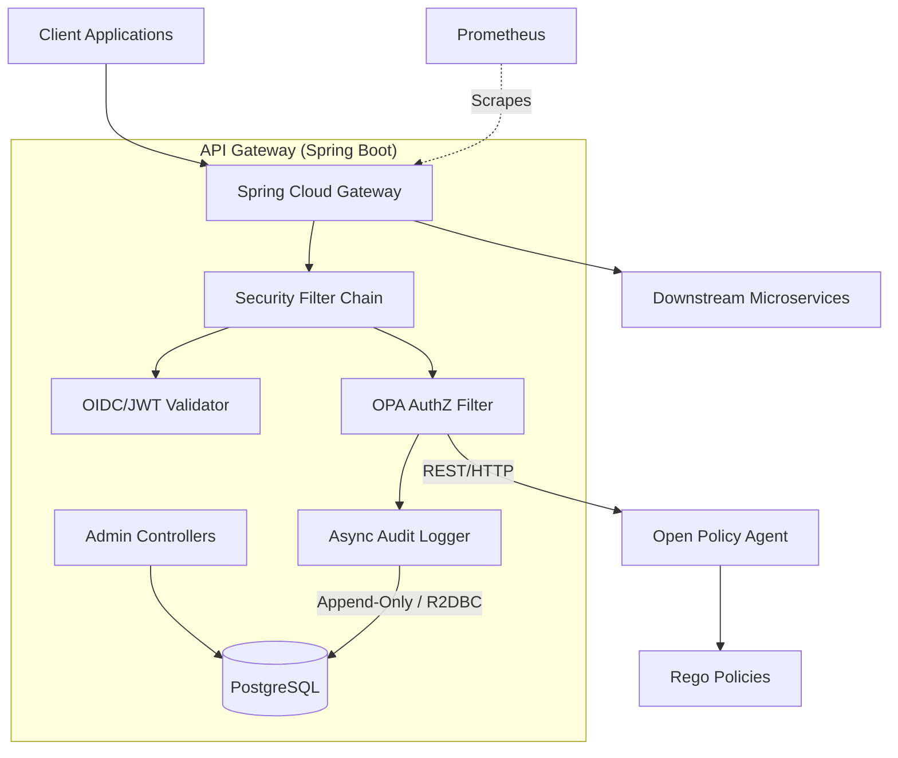

# Enterprise Policy & RBAC Gateway

An enterprise-grade, reactive API Gateway built with Spring Cloud Gateway. It enforces edge authentication via OIDC/JWT and integrates with Open Policy Agent (OPA) for declarative, route-level authorization and dynamic RBAC. The project includes a fully non-blocking, append-only PostgreSQL audit log and deep Prometheus metrics for comprehensive observability and compliance.

## Architecture



## Key Features
* **Edge Authentication:** Built-in Spring Security OAuth2 Resource Server to validate JWTs at the network edge before traffic touches internal microservices.
* **Declarative Authorization (OPA):** Outsources complex authorization logic to Rego policies via Open Policy Agent, ensuring policy logic can be updated without redeploying code.
* **Immutable Audit Logging:** Every allow/deny authorization decision is asynchronously logged to a PostgreSQL database via R2DBC, preventing blocking on the critical request path.
* **Full Observability:** Instrumentations via Micrometer to expose Promethues metrics (`gateway.authz.decisions`, `gateway.authz.opa.latency`).
* **Non-Blocking / Reactive:** Built purely on Project Reactor (WebFlux) ensuring massive throughput with minimal thread usage.

## Tech Stack
* **Java 21**
* **Spring Boot 3.4.0** (Spring Cloud Gateway, WebFlux, Security)
* **PostgreSQL & Flyway** (Schema versioning)
* **Spring Data R2DBC** (Reactive DB Driver)
* **Open Policy Agent (OPA)**
* **Micrometer & Prometheus**

---

## Getting Started

### Prerequisites
* Java 21+
* Docker & Docker Compose (to run Postgres and OPA locally)
* Gradle

### 1. Start Infrastructure
We need to run PostgreSQL (for audit logs) and OPA locally. You can spin these up quickly using Docker:

```bash
# Start PostgreSQL
docker run -d --name rbac-postgres \
  -e POSTGRES_USER=admin \
  -e POSTGRES_PASSWORD=password \
  -e POSTGRES_DB=audit_db \
  -p 5432:5432 postgres:15

# Start Open Policy Agent (OPA)
docker run -d --name rbac-opa \
  -p 8181:8181 openpolicyagent/opa:latest run --server
```

### 2. Run the Gateway
Flyway will automatically initialize the database schema on startup.

```bash
./gradlew bootRun
```

---

## Admin Endpoints
The gateway exposes a set of Admin APIs (under `/admin/**`) to manage roles and policies at runtime:

### Roles
* `POST /admin/roles` - Create a new role definition
* `GET /admin/roles` - List available roles
* `DELETE /admin/roles/{roleId}` - Delete role

### Policies
* `POST /admin/policies/{policyId}` - Upload a new Rego policy definition
* `GET /admin/policies` - List currently managed policies

---

## Observability & Metrics
Metrics are exported in Prometheus format via Spring Boot Actuator. Once the application is running, you can scrape the endpoint at:

```
GET http://localhost:8080/actuator/prometheus
```

**Key Metrics Tracked:**
* `gateway_authz_decisions_total` - Total count of authorization decisions, tagged by `route` and `decision` (allow/deny).
* `gateway_authz_opa_latency_seconds` - Execution timer evaluating the latency overhead introduced by contacting OPA.
